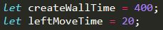
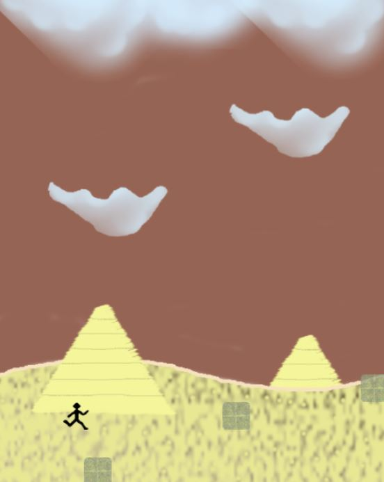

# Egyptian Block Game

This game is based on DIO Dino Game, which you can find <a href="https://github.com/celso-henrique/dio-dino-game">here</a>. This is subject of a class in <a href="https://digitalinnovation.one/">Digital Innovation One</a>.

## Changes:

* Changed the background image
* Removed "cactus" and inserted blocks
* Removed "Dino" and inserted a human
* Removed jump and inserted moves

## Features:

* Human can move Up, Down, Left and Right
* Blocks will appear in five different positions

## Info:

I created all the images with the software <a href="https://www.gimp.org/">GIMP</a>. They are not that beautiful because I am not a super talented artist :laughing:

I did not created modes in this game, but it is set to "_normal_". If you wanna try the "_hard_" mode, decrease the following variables in scrypt.js.

# Example

